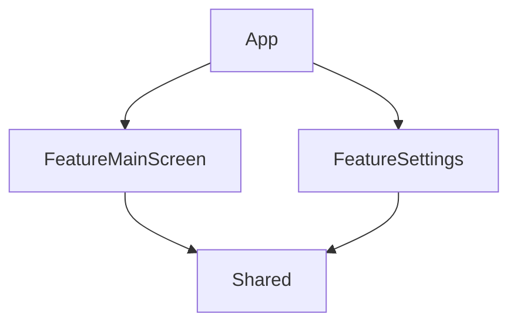

# Dependencies article example

How we do Dependency Injection in [Aviasales](https://avisales.com)

## What to try

🖼️ Use Preview and see `ModuleDependencies.preview` in action

📱 Run application and see `ModuleDependencies.live` showing real data and handling real logic

🟥 Run tests and see how dependencies are managed. Try removing Dependency setup and see a crash with `ModuleDependencies.failing` approach

🎛️ Check `SetupMainScreenDependencies()` method that sets up external dependencies. It is used when module doesn't know about context of usage.

## Modules

Simplified module system to show relations and need for external dependencies logic.

